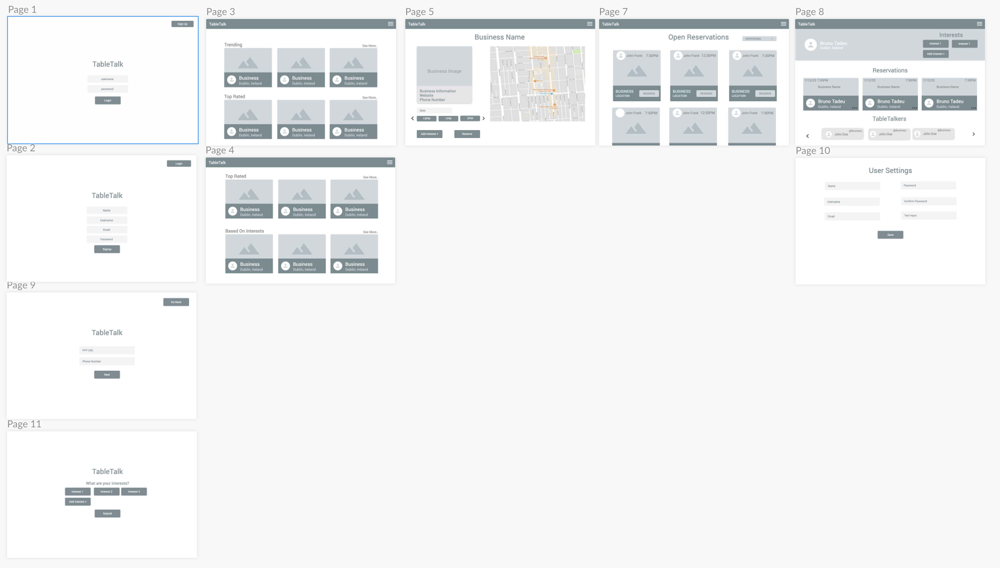
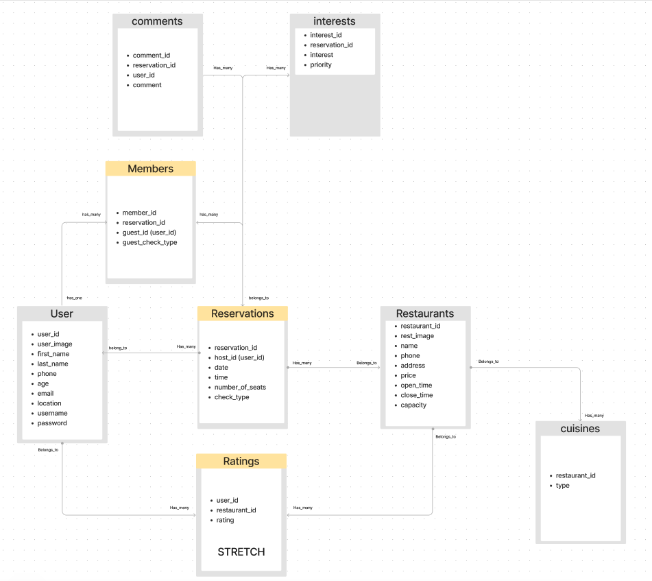
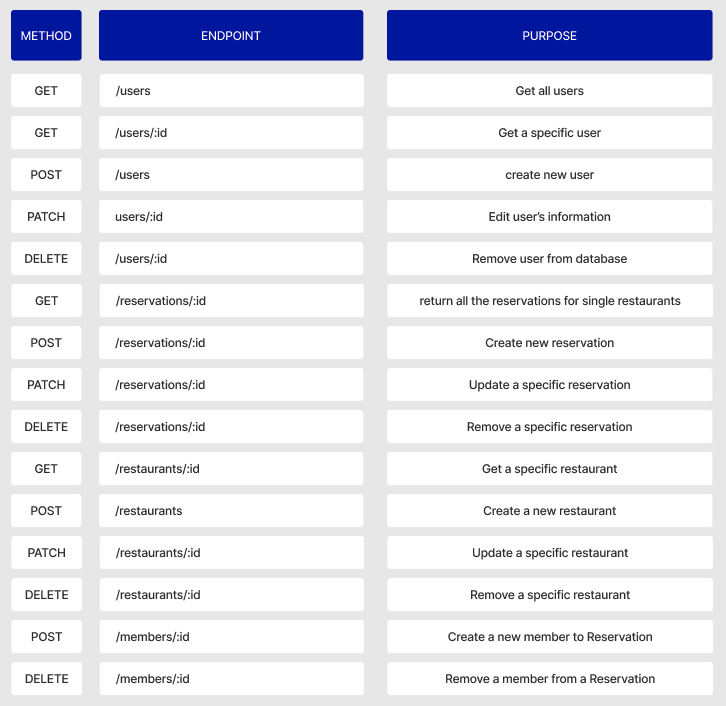
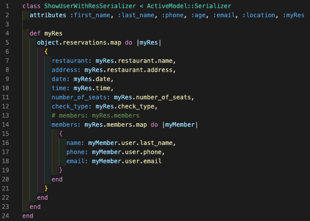
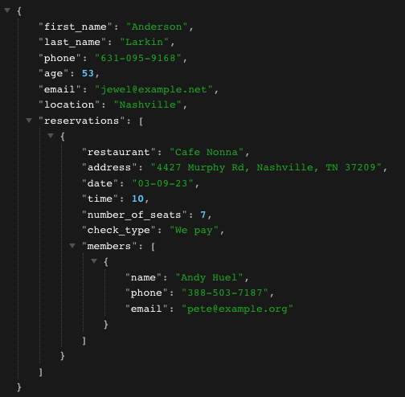
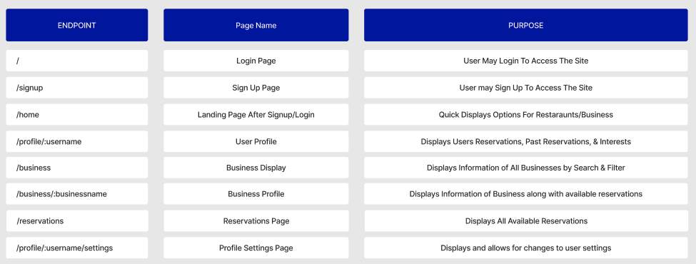
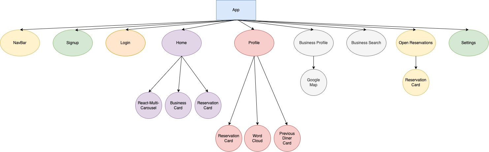

# TableTalk

TableTalk allows users to book reservations at restaurants and have other users (usually strangers) join their table to have a great meal, great conversations, and great time!

## github repository
https://github.com/Irishwolf13/TableTalk

## Wireframe
* Quick demo of TableTalk [wireframe](https://www.fluidui.com/editor/live/preview/cF9XZ2h4VG9LUTJjcHRWcEU3cm9ta1ViRTAzUzZmSUloYg==)

## User Stories
1. A user can view reservations and restaurants
2. A user can make a reservation
3. A user can update their reservation
4. A user can delete their reservation
5. A user can join an existing reservation
6. A user can comment on an existing reservation
7. A user can add Interests to their reservation or a reservation they're a member of
8. A user can log in to an existing account
9. A user can sign up for an account
10. A user can update their account
11. A user can delete their account
12. A user can search for a reservation or restaurant

## Backend
Here's a breakdown of the backend:
### Models
1. A User has many Reservations, has many Ratings, and has many Members
2. A Reservation has many Members, has many Interests, has many Comments, belongs to a User, belongs to a Restaurant, and belongs to a User
3. A Restaurant has many Reservations, has many Ratings, and has many Cuisines
4. A Member has has one User and belongs to a Reservation
5. A Rating belongs to a User and belongs to a Restaurant
6. A Cuisine belongs to a Restaurant
7. A Comment belongs to a Reservation
8. An Interest belongs to a Reservation
### Entity-Relationship Diagram (ERD)

### Model Validations
#### Users
* validates **presence** for first_name, last_name, email, phone number, location, username, and password
* validates **format** for phone number (/\A\+?\d{1,3}[-.\s]?\d{1,10}\z/)
* validates **inclusion** for age (between 18 and 99)
* validates **length** for password (minimum: 8)
* validates **format** for password (includes 1 digit)
* validates **uniqueness** for email
* validates **format** for email (VALID_EMAIL_REGEX)

#### Reservations
* validates **presence** for reservation_id, user_id, date, time, number_of_seats, and check_type
* validates **numericality** for time

#### Members
* validates **presence** for reservation_id and user_id

#### Ratings (stretch goal)
* validates **presence** for user_id, restaurant_id, and rating
* validates **numericality** for rating
* validates **inclusion** for rating (between 1 and 5)

#### Comments
* validates **presence** for reservation_id, user_id, and comment
* validates **length** for comment (between 2 and 500)

### API Endpoints

### Serializer Example
* Code Snippet

* Server Snippet
 

## Frontend
### React Client-Side Routing

### React Component Tree

## Stretch Goals
* CRUD/UI for restaurants
* Ratings for restaurants

## Technologies
* Ruby
* Ruby on Rails
* ActiveRecord
* React
* JavaScript
* CSS